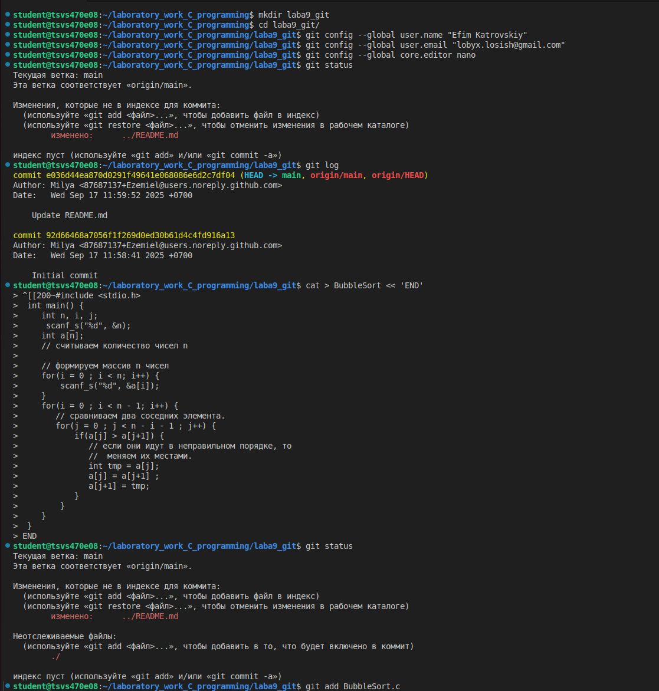
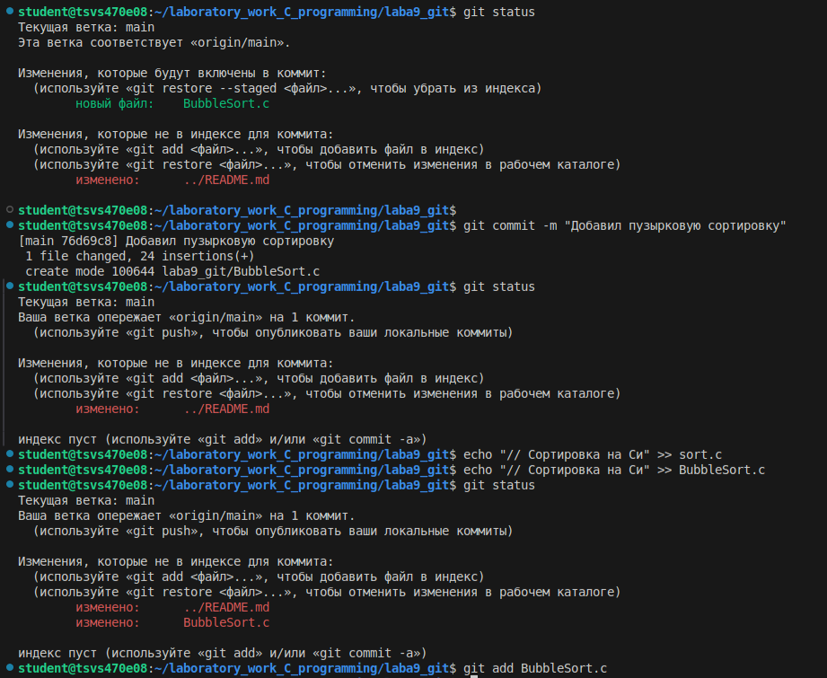

# Лабораторные работы по программированию на языке C/C++ 
(Ефим Катровский ИКС-532)

## Лабораторная работа № 9

Работа с Git



## 1-5 шага
1. По первому шагу мы видим что текущая ветка main (она автоматически создается git - как самая главная), видим файлы которые пока что не индексированы, (также может показывать файлы что Git не отслеживает) то есть локально изменены, но на удаленный репозиторий не отправлены пока что, пока не пропишем команду git add и позже git commit;
    * git status — это команда в Git, которая отображает текущее состояние репозитория, показывая, какие файлы были изменены, какие находятся в индексе (подготовлены к коммиту), а какие еще не отслеживаются системой контроля версий.

2. Второй шаг показывает все коммиты что были сделаны в эту ветку, показывает по таким характеристикам как хэш коммита (уникальный идентификатор), автора коммита, дата коммита, комментарий к коммиту;
    * git log — команда в Git, которая позволяет просматривать историю коммитов в репозитории.

3. Создаем файл с пузырковой сортировкой;
    * Код самой сортировки:
    ```
     #include <stdio.h>
        int main() {
            int n, i, j;
            scanf_s("%d", &n);
            int a[n];
            // считываем количество чисел n

            // формируем массив n чисел
            for(i = 0 ; i < n; i++) { 
                scanf_s("%d", &a[i]);
            }
            for(i = 0 ; i < n - 1; i++) { 
            // сравниваем два соседних элемента.
            for(j = 0 ; j < n - i - 1 ; j++) {  
                if(a[j] > a[j+1]) {           
                    // если они идут в неправильном порядке, то  
                    //  меняем их местами. 
                    int tmp = a[j];
                    a[j] = a[j+1] ;
                    a[j+1] = tmp; 
                }
                }
            }
        }
    ```

4. После чего проверим статус нашего Git через команду что демонстрировали в 1-ом шаге, пока что ничего не отслеживает как и наш файл BubbleSort.c и папка в которой находится сортировка;

5. Инициализируем файлик через команду git add "Имя файла"
    * git add — это команда Git, которая добавляет изменения из рабочего каталога в «область подготовки» (staging area).


Работа с Git



## 6-11 шага